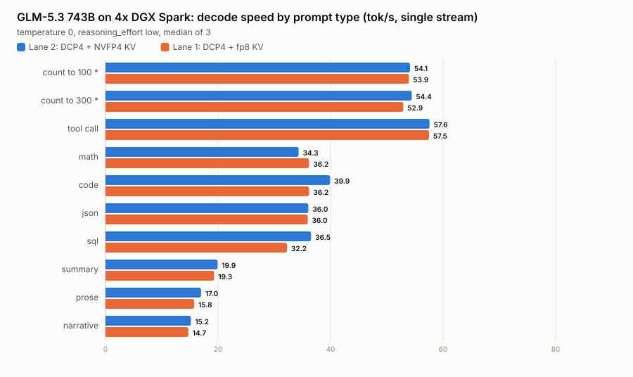
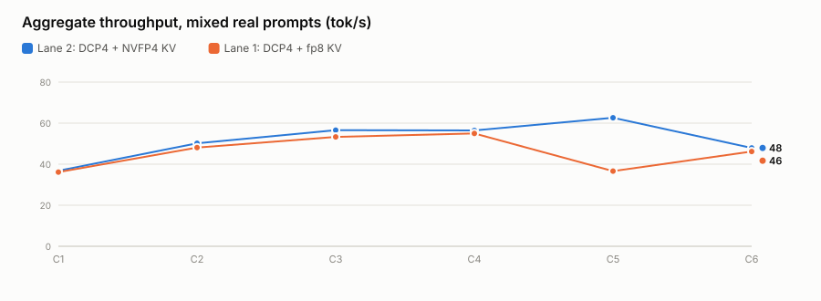

# GLM-5.3-Int4-Int8Mix — TP4 on 4× DGX Spark

**The first Int4-Int8Mix quantization of big GLM-5.3 (743B), quantized and served on four
NVIDIA DGX Spark (GB10 / sm121 / aarch64).**

No quantization of the large GLM-5.3 existed anywhere when this was made. This repo is the
recipe: how the quant was produced, how it is verified, and how it is served at TP4 across
four 121 GB unified-memory boxes.

> ### 📦 Weights
> **[`2wild4tv/GLM-5.3-Int4-Int8Mix`](https://huggingface.co/2wild4tv/GLM-5.3-Int4-Int8Mix)** — 377.4 GiB, 282 shards.
>
> The weights are **not** in this repository (GitHub cannot hold 378 GB). This repo holds the
> quantization script, the verification gates, and the serving recipe.

> **Status (2026-10-06): two DCP4 lanes.** TP4 + decode context parallelism (DCP4) + DFlash2 k=7, with
> [@ajclark](https://github.com/ajclark)'s DCP patch set. **Lane 2 (NVFP4 KV)** holds a **689,772-token KV
> pool at 262K context**, 2.35× the previous best lane, at the same decode speed, and serves a
> **524,288-token window** (594,532-token pool, needle 3/3 at 490,425 tokens). Lane 1 (fp8 KV) holds 462,308. The trade-off is prefill
> (~400 tok/s). Earlier stages (quantization 2026-08-28, DFlash2 and NVFP4 KV 2026-08-29) are below,
> unchanged. The 69-scenario quality eval has **not** been run; no claim of quality parity with the BF16
> base is made here.

---

## ⭐ New (2026-10-06): two DCP4 lanes, up to a 689,772-token KV pool with DFlash2

<picture>
  <source media="(prefers-color-scheme: dark)" srcset="runs/2026-10-06-dcp4-dflash2/charts/suite-dark.svg">
  
</picture>

| prompt | **Lane 2** decode tok/s | Lane 2 end to end | Lane 1 decode | Lane 1 end to end | Lane 2 TTFT / time to answer | Lane 2 accept, mean len |
|---|---|---|---|---|---|---|
| count to 100 * | 54.1 | 50.8 | 53.9 | 50.6 | 0.28 / 0.70 s | 96%, 7.69 |
| count to 300 * | 54.4 | 53.3 | 52.9 | 51.6 | 0.28 / 0.71 s | 97%, 7.78 |
| tool call | 57.6 | 24.1 | 57.5 | 24.3 | 0.83 s | 86%, 7.00 |
| code | 39.9 | 38.8 | 36.2 | 35.3 | 0.54 s | 71%, 5.97 |
| json | 36.0 | 35.2 | 36.0 | 35.2 | 0.47 / 0.77 s | 61%, 5.26 |
| math | 34.3 | 33.2 | 36.2 | 35.2 | 0.46 / 3.74 s | 57%, 4.99 |
| sql | 36.5 | 35.5 | 32.2 | 31.2 | 0.47 / 1.35 s | 63%, 5.42 |
| summary | 19.9 | 19.7 | 19.3 | 19.1 | 0.46 s | 25%, 2.78 |
| prose | 17.0 | 16.9 | 15.8 | 15.7 | 0.39 / 0.97 s | 21%, 2.45 |
| narrative | 15.2 | 15.0 | 14.7 | 14.6 | 0.49 s | 17%, 2.19 |

Single stream, temperature 0, `reasoning_effort: low`, median of 3. \* Counting prompts show the speculative-decoding ceiling (draft acceptance ~97%), not a typical rate; prose-like text accepts ~20% of drafted tokens. The tool call is 34 tokens, so its end-to-end rate is mostly time to first token. **The two lanes decode at the same speed:** they run the same kernels, and per-prompt gaps of up to ~10% either way track the draft acceptance of that run, which varies run to run on this stack. What separates them is the KV pool.

Two new lanes, both TP4 + **decode context parallelism (DCP4)** + DFlash2 k=7 on the same four Sparks. DCP
shards the target model's KV cache across the four ranks instead of keeping a copy on each, so the same
memory holds four times the context. The DCP + DFlash2 patch set is **[Allan Clark (@ajclark)](https://github.com/ajclark)'s**
([issue #4](https://github.com/tonyd2wild/GLM-5.3-Int4-Int8Mix-TP4-4x-DGX-Spark/issues/4),
[his repo](https://github.com/ajclark/GLM-5.3-DCP4-DFlash2-NVMe-KV-Offload-4x-DGX-Spark), vendored in
[`dcp/`](dcp/) under his Apache-2.0 license). Lane 2 combines it with this repo's NVFP4 KV port, which nobody
had run together before.

| lane | KV cache | context | KV pool (vLLM) | KV pool (measured) | KV per rank | launcher |
|---|---|---|---|---|---|---|
| **Lane 2: DCP4 + NVFP4 + DFlash2** (serving default) | `nvfp4_ds_mla`, 400 B/token | 262,144 | **689,772** (2.63×) | ~650,000 | 7 GB | [`launch-glm53big-dcp4-nvfp4.sh`](launch/launch-glm53big-dcp4-nvfp4.sh) |
| Lane 2 at 512K | `nvfp4_ds_mla` | 524,288 | 594,532 (1.13×) | ~580,000 (490,425 tokens used 84.6%) | 6.0 GB | same, `MAXLEN=524288 KVBYTES=6000000000` |
| Lane 1: DCP4 + fp8 + DFlash2 | `fp8_ds_mla`, 656 B/token | 262,144 | 462,308 (1.76×) | ~433,900 | 7 GB | [`launch-glm53big-dcp4.sh`](launch/launch-glm53big-dcp4.sh) |
| previous best: NVFP4 + DFlash2, no DCP | `nvfp4_ds_mla` | 270,000 | 293,447 | not measured | 10.95 GB | [`launch-glm53-nvfp4-dflash2.sh`](launch/launch-glm53-nvfp4-dflash2.sh) |

**What it costs: prefill.** DCP4 prefill runs at roughly 340-415 tok/s at every prompt length we tried (5K to
490K tokens). On the same 15,662-token prompt the DCP1 reference answered in 29 s and DCP4 in 45 s, and a cold
100K-token prompt takes about four and a half minutes. Decode is barely touched on this switched fabric: count-to-100 end to end is 50.8 tok/s against
53.3 for the old DCP1 fp8 lane (about -5%; the old figure is from this repo's earlier harness), where ajclark
measured about -22% on his switchless ring. Prefix caching hides most of the prefill cost for agents that resend
the same context.

### Concurrency, prefill and long context

<picture>
  <source media="(prefers-color-scheme: dark)" srcset="runs/2026-10-06-dcp4-dflash2/charts/sweep-dark.svg">
  
</picture>

| streams | **Lane 2** aggregate, median / peak | Lane 1 aggregate, median / peak | Lane 2 per-stream decode | Lane 2 TTFT p90 |
|---|---|---|---|---|
| C1 | 33.9 / 36.8 | 33.9 / 36.1 | 35.1 | 0.60 s |
| C2 | 34.1 / 50.2 | 32.8 / 48.1 | 27.4 | 1.29 s |
| C3 | 31.0 / 56.6 | 28.6 / 53.3 | 20.8 | 1.48 s |
| C4 | 56.0 / 56.5 | 54.9 / 55.0 | 20.0 | 1.89 s |
| C5 | 38.4 / 62.6 | 32.7 / 36.6 | 16.1 | 2.05 s |
| C6 | 41.9 / 47.9 | 41.7 / 46.2 | 14.7 | 2.25 s |

Mixed real prompts (code, json, sql, tool call, math, prose, narrative, summary rotated across streams), 3 rounds per level, 0 failures, 0 preemptions. A round's aggregate is bound by its slowest stream (a 700-token prose answer at ~15 tok/s), so median and peak differ with the mix.

| | **Lane 2** (NVFP4) | Lane 1 (fp8) |
|---|---|---|
| cold prefill, 5,020 tokens | 416 tok/s (TTFT 12.1 s) | 395 tok/s at 5,019 tokens |
| cold prefill, 31,900 tokens | 414 tok/s (TTFT 77.0 s) | 381 tok/s at 31,897 tokens |
| cold prefill, 106,130 tokens | 395 tok/s (TTFT 268.7 s) | 364 tok/s at 106,130 tokens |
| decode at a ~115K-token context, 1 stream | 16.2 tok/s (TTFT 290 s) | 17.0 tok/s (TTFT 313 s) |
| needle test, 3 codes at 10/50/90% depth | **3/3** at 254,389 tokens (TTFT 677 s) | 3/3 at 254,388 tokens (TTFT 743 s) |
| needle test at the 512K window | **3/3** at 490,425 tokens (TTFT 1423 s) | - |
| one 204,902-token request holds | 31.5% of the pool | 47.2% of the pool (204,901 tokens) |
| lowest free memory, any node | 2.3 GB (262K) / 3.8 GB (512K) | 3.1 GB |

### Is the NVFP4 + DCP merge correct?

Two of ajclark's DCP files had to be merged by hand with the NVFP4 port (`flashmla_sparse.py`, 5 conflicts;
`b12x_sparse_helpers.py`, 2), two merged cleanly (`mla_attention.py`, `kv_cache_interface.py`), and one DCP
guard that whitelisted only `fp8_ds_mla` was extended to `nvfp4_ds_mla` for the reason its own comment gives
(inline scales, kernel-side dequantization, bf16 query). Notes: [`dcp/glm-dcp-nv/MERGE-NOTES.md`](dcp/glm-dcp-nv/MERGE-NOTES.md).

The test was planned as a temperature-0 token-for-token match against the same stack at DCP1. **That test
cannot pass on this stack for any lane:** the DCP1 reference run twice on the same prompts matched itself on
only 3 of 8 (the MoE kernels use atomic adds, `VLLM_MARLIN_USE_ATOMIC_ADD=1`, so summation order differs run to
run, and speculative decoding changes the batch shapes). So the gate scores the same token sequences on both
lanes (teacher forcing, prefill only, no sampling or drafting) and compares every per-token log-probability:

| | completion tokens: mean / p99 \|Δ logprob\| | prompt tokens: mean / p99 | long 20K prompt, completion mean |
|---|---|---|---|
| DCP1 reference vs itself (noise floor) | 0.0220 / 0.487 | 0.2530 / 1.127 | 0.0065 |
| **DCP4 + NVFP4 vs reference** | **0.0232 / 0.551** | **0.2564 / 1.138** | **0.0030** |

DCP4 sits inside the reference's own run-to-run noise, and on the longest prompt, where the cross-rank merge
does the most work, closer to the reference than the reference is to itself. Greedy outputs: 4/8 identical
(the reference vs itself: 3/8), including both long-context prompts (300 tokens identical at 15,662 tokens of
context); every divergence is at a near-tie. Both buried codes were retrieved and count-to-100 was 100/100.
Scorer: [`bench/tf_score.py`](runs/2026-10-06-dcp4-dflash2/bench/tf_score.py).

### Findings worth knowing

- **vLLM's KV-pool figure is close here, unlike on GLM-5.3-Flash.** One 204,901-token request held 47.2% of the
  fp8 lane's blocks: measured capacity ~433,900 tokens against the reported 462,308 (6.5% optimistic).
  On lane 2 a 204,902-token request held 31.5%: ~650,000 against the reported 689,772 (+6.1%). On the Flash model the same check found 2× ([Flash repo PR #12](https://github.com/tonyd2wild/GLM-5.3-Flash-NVFP4-1M-KV-4x-DGX-Spark/pull/12)).
  The `cache_config_info` metric reports a third number (312,035 on lane 1); use the boot log or measure.
- **Not deterministic at temperature 0**, even without DCP (above). Compare lanes with teacher forcing, not text.
- **This vLLM streams thinking as `reasoning`, not `reasoning_content`.** A harness that only watches
  `reasoning_content` measures time-to-first-*answer* and divides thinking tokens by the answer window:
  math read 50 tok/s instead of 36. The harness here counts both and reports time to first token and time to
  answer separately.
- **Filler text tokenizes 3.5× denser on the 743B tokenizer** than on Flash's (`w123`-style words); size
  synthetic prompts with `/tokenize`, not word counts.
- **`--max-num-batched-tokens 2048` under DCP** (ajclark's validated value; the DCP-gathered fp32 accumulator
  is 4× per token). 4096 is untested and is the first thing to try for faster prefill.

### Method

Speed-night harness ([`bench/`](runs/2026-10-06-dcp4-dflash2/bench/)), temperature 0, `reasoning_effort: low`,
median of 3, GPUs verified first (85.7-90.1 TFLOPS bf16 on all four, `gputest.sh`). The endpoint served live
agents during the runs, so every measurement waited for an idle server, sampled `running + waiting` while it
ran, and was retried when other requests appeared; dirty cells were re-run (`rerun_dirty.py`). Raw JSON, logs
and per-lane summaries: [`runs/2026-10-06-dcp4-dflash2/`](runs/2026-10-06-dcp4-dflash2/).

### Run it

```bash
# every node: the DCP overlay set and the patched paged-MQA kernel (see dcp/README.md)
cp -r dcp/glm-dcp ~/glm-dcp && cp -r dcp/glm-dcp-nv ~/glm-dcp-nv
cp -a ~/glm-triton ~/glm-triton-aj && cp dcp/glm-triton-aj/sm12x_mqa.py ~/glm-triton-aj/
# ranks 1, 2, 3 first, then 0 (rank 0 serves :8000)
./launch/launch-glm53big-dcp4-nvfp4.sh <rank>                                  # lane 2, 262K
MAXLEN=524288 KVBYTES=6000000000 ./launch/launch-glm53big-dcp4-nvfp4.sh <rank>   # lane 2 at 512K
./launch/launch-glm53big-dcp4.sh <rank>                                        # lane 1 (fp8 image)
```

Lane 2 needs `vllm-glm52-b12x:nvfp4-dflash2-p2` ([`dflash2-port/build_node_nvfp4.sh`](dflash2-port/build_node_nvfp4.sh)),
lane 1 `vllm-glm52-b12x:dflash2-port2`. Run the cache flusher during boot, as for every lane here.

---

## What it is

| | |
|---|---|
| Base | [`zai-org/GLM-5.3-BF16`](https://huggingface.co/zai-org/GLM-5.3-BF16) — 1507 GB, 282 shards, genuine BF16 |
| Architecture | `GlmMoeDsaForCausalLM` (`model_type: glm_moe_dsa`) — served by vLLM's `deepseek_v2` path |
| Size | 743B total / ~40B active MoE |
| Layers | 78 + MTP head at layer 78; `first_k_dense_replace: 3` → 3 dense + 75 sparse |
| Dims | hidden 6144, `kv_lora_rank` 512, `qk_nope` 192, `qk_rope` 64, `index_topk` 2048 |
| Experts | 256 routed + 1 shared, 8 active per token |
| Quantized output | **377.4 GiB**, 282 shards, `compressed-tensors` / `pack-quantized` |
| Per-rank at TP4 | **95.53 GiB** (98.07 GiB with MTP loaded) |

**Why a BF16 base and not the fp8 repo:** the main `zai-org/GLM-5.3` repo already ships fp8
(`quant_method: fp8`, e4m3, block 128×128). The QuantTrio recipe deliberately keeps the MoE
router, the DSA indexer, the LM head and layer 0 at **full precision** — from a BF16 base
those stay true BF16; from an fp8 base they would be fp8, degrading exactly the layers that
matter most for accuracy.

---

## The quantization recipe

Config groups and ignore list are taken **verbatim** from
[`QuantTrio/GLM-5.2-Int4-Int8Mix`](https://huggingface.co/QuantTrio/GLM-5.2-Int4-Int8Mix).

That transfer is not an assumption — GLM-5.2 and GLM-5.3 were diffed and are structurally
identical: **56 top-level config keys each**, differing only in `moe_router_dtype` (5.3) vs
`name_or_path` (5.2). Layers, hidden size, `kv_lora_rank`, `qk_rope_head_dim`, `index_topk`,
expert count and `first_k_dense_replace` all match, and both resolve to
`GlmMoeDsaForCausalLM`.

Data-free RTN — **no calibration dataset**, static, symmetric, weight-only, group size 128.

| group | targets | bits | strategy | modules matched |
|---|---|---|---|---|
| `w4a16_experts` | layers 3–77 `mlp.experts.N.{gate,up,down}_proj` | 4 | group / 128 | **57,600** |
| `w8a16_linears` | layers 1–77 attention projections + dense & shared-expert MLP | 8 | group / 128 | **616** |
| `w8a16_mtp_channel` | layer 78 (MTP) attention + MLP + experts | 8 | **channel** (gs −1) | **776** |

Counts reconcile exactly — 75 sparse layers × 256 experts × 3 projections = 57,600.

### Kept at full precision

This list is what protects accuracy. Do not shorten it.

- `model.layers.0.*` — the entire first layer
- every `mlp.gate` — the **MoE router**; quantizing it destroys expert routing
- `self_attn.indexer` and `self_attn.indexers_proj` — the DSA sparse-attention selector
- MTP `eh_proj`, `enorm`, `hnorm`, `shared_head.norm`, `shared_head.head`
- `lm_head`

`kv_cache_scheme: None` — KV precision is a serve-time choice (`--kv-cache-dtype`), not baked
into the weights.

---

## How it was quantized — shard streaming, not `oneshot`

`llmcompressor.oneshot` with accelerate disk-offload is **not usable here**: offloading a
1507 GB model needs ~1.4 TB of scratch, and with the BF16 base (1507 GB) and the output
(378 GB) both on the fleet, no node has that free.

[`quant/glm53_quant_stream.py`](quant/glm53_quant_stream.py) instead streams the checkpoint:
read one BF16 shard → quantize its targeted tensors → pack → write one output shard. Peak RAM
is roughly one shard in plus one shard out (~10 GiB), and the 1:1 shard mapping makes the job
**resumable** — a completed output shard is skipped on restart.

It uses `compressed-tensors`' own `calculate_qparams`, `quantize` and `pack_to_int32` rather
than reimplementing the bit packing, which removes an entire class of silent-corruption bugs.

One detail worth copying: the scale is **rounded to bf16 before quantizing**, so the scale
persisted to disk is exactly the one quantization assumed. Compute in fp32, round, then
quantize with the rounded value — otherwise dequantization at serve time uses a slightly
different scale than the quantizer did.

**Runtime: 28.2 minutes** for 377.4 GiB on a single DGX Spark, CPU-only.

### Verify before you quantize, and again after

Two gates, both fail-closed:

- [`quant/dryrun_layermap.py`](quant/dryrun_layermap.py) — compiles the group regexes against
  the **actual** tensor names in the base index and prints per-group match counts before a
  single tensor is touched. A regex that silently matches nothing produces a quant that looks
  fine and is wrong.
  **Match module names, not tensor names.** The group patterns are anchored (`...o_proj$`)
  and describe *modules*, while `weight_map` keys are *tensors* (`...o_proj.weight`). Compare
  them directly and every group reports zero matches.
- [`quant/verify_quant.py`](quant/verify_quant.py) — after the run: tensor accounting, per-group
  counts, sacred-module checks, shard completeness, dtype spot-checks, config validation.

Results on this quant:

```
source tensors        59,585
quantized modules     58,992
expected out tensors  177,569
actual   out tensors  177,569        exact
group counts          57,600 / 616 / 776    matches the pre-quant dry-run exactly
sacred modules        eh_proj, mlp.gate, layer 0, lm_head -> plain BF16, 0 packed leaks
indexer               0 quantized
shards                282, none missing, declared == on-disk 377.4 GiB
```

On-disk layout matches QuantTrio byte-for-byte (checked against their published shards by
range-reading the safetensors headers):

| tensor | QuantTrio | this quant |
|---|---|---|
| expert `down_proj.weight_packed` | I32 `[6144, 256]` | I32 `[6144, 256]` |
| expert `down_proj.weight_scale` | BF16 `[6144, 16]` | BF16 `[6144, 16]` |
| MTP `down_proj.weight_scale` | BF16 `[6144, 1]` | BF16 `[6144, 1]` |

Round-trip error: int8 group/128 ≈ **0.70%** relative, int4 group/128 ≈ **12%** (normal for 16
levels); 256 / 16 distinct levels — full range used.

---

## Serving

[`launch/launch-glm53-tp4.sh`](launch/launch-glm53-tp4.sh) — one `docker run` per node, vLLM's
**native** multi-node (`--nnodes/--node-rank/--master-addr`), **no Ray**. Workers start
headless, head last.

It is derived from
[`tonyd2wild/GLM-5.2-QuantTrio-200K-4x-DGX-Spark--36tok-s`](https://github.com/tonyd2wild/GLM-5.2-QuantTrio-200K-4x-DGX-Spark--36tok-s),
whose 10 sm12x Triton kernel overlays and modded image are **required** on GB10 — stock vLLM
kernels fault on sm121. Follow that repo for the image build and kernel staging; this repo
changes only the weights path and the served name.

```bash
./launch/launch-glm53-tp4.sh <rank 0-3> [none|mtp|dflash]
```

### GB10 unified memory — the thing that will bite you

CPU and GPU share one 121 GB pool, so **host page cache consumes CUDA-visible memory 1:1**.
Measured on this fleet: with 37 GiB of page cache, CUDA reported only **74.25 / 121.69 GiB**
free — a hard ceiling of `gpu-memory-utilization 0.61`. After dropping caches, 105–113 GiB.

Consequences, all learned the hard way:

1. **Run [`launch/cache_flusher.sh`](launch/cache_flusher.sh) on every node** for the whole
   boot. It drops caches unconditionally every 60 s. A *conditional* flusher (only when cache
   exceeds a threshold) can sit there and never fire while still leaving you short.
2. **Pin `--kv-cache-memory-bytes`.** Sizing KV off "currently free" memory means the same
   command boots or OOMs depending on what the page cache happened to look like at profiling
   time. Pinning it makes boots deterministic.
   Caveat: pinning it also makes vLLM **skip memory profiling entirely** — it then never
   validates that what remains is enough for activations, NCCL buffers and graphs.
3. **Set `vm.swappiness` to 10.** At the default 0–1 the box will wedge with 16 GB of swap
   completely untouched.

### Steady state is meant to be tight

MemAvailable ~0.7 GB with ~3.2 GB of swap parked is the **designed** operating point for this
config class, not a warning sign.

---

## Results

### NVFP4 KV + DFlash2 — the best-of-both lane

NVFP4's 400 B/token KV record **and** the DFlash2 drafter together. Previously
impossible because the NVFP4 image shipped without DFlash2 support; both bases
turn out to be the same vLLM commit, so the DFlash2 port applies unchanged.

```
image  vllm-glm52-b12x:nvfp4-dflash2-p2      spec  dflash k=7
kv     nvfp4_ds_mla --kv-cache-dtype-skip-layers sliding_window
ctx    270,000        KV pool  293,447 tokens
```

| lane | count100 | C1 | C2 | C3 | C4 | C5 | C6 | KV pool | ctx |
|---|---|---|---|---|---|---|---|---|---|
| **NVFP4 + DFlash2** | **51.03** | 17.81 | 28.16 | 34.86 | 38.72 | 43.11 | 50.98 | **293,447** | **270K** |
| NVFP4 + MTP-5 | 25.37 | 17.78 | 26.29 | 34.07 | 40.34 | 46.20 | **53.31** | **317,278** | 300K |
| fp8 + DFlash2 (k=7) | **53.32** | 18.70 | 27.34 | 35.37 | 40.96 | 45.96 | 49.88 | 179,479 | 80K |
| fp8 + MTP-4 | 26.91 | 19.62 | 26.17 | 32.54 | 45.97 | 52.07 | 51.93 | 200,064 | 200K |

count-to-100: 100/100 correct, 95.6% acceptance. It keeps essentially all of
fp8+DFlash2's structured-output speed (−4%) while carrying a **63% larger KV
pool** and **3.4× the context**.

~~**DCP is impossible with DFlash2.**~~ **Corrected 2026-10-06: it is possible.** The assert this
paragraph quoted is real, but it is a placement rule, not a model or hardware limit.
[@ajclark](https://github.com/ajclark) shards the sparse-MLA target cache across the DCP ranks and keeps
the drafter's sliding-window group replicated, and DCP4 + DFlash2 now runs on this recipe: see
[DCP4 + DFlash2](#dcp4--dflash2-2026-10-06) above and [`dcp/`](dcp/).

**Leave headroom for the drafter group:** 300K fails with `11.06 GiB needed vs
10.2 GiB available`; the drafter costs ~8% of the pool versus the MTP lane.

Full write-up: [`bench/RESULTS-nvfp4-dflash2.md`](bench/RESULTS-nvfp4-dflash2.md).
Launcher: [`launch/launch-glm53-nvfp4-dflash2.sh`](launch/launch-glm53-nvfp4-dflash2.sh).

### NVFP4 KV cache — 317,278-token pool at 300K context

Measured 2026-08-29. **End-to-end** tok/s (wall clock, request send → full
response received), not the engine's internal decode rate.

```
image    vllm-node-tf5-glm52-b12x:nvfp4-v1
overlay  /var/tmp/glm-triton-nvfp4      ← NOT ~/glm-triton; this is the switch
kv       nvfp4_ds_mla (400 B/token vs fp8_ds_mla's 656)
ctx      300,000        KV pool 317,278 tokens        MTP k=5
```

| lane | count100 | C1 | C2 | C3 | C4 | C5 | C6 | KV pool | ctx |
|---|---|---|---|---|---|---|---|---|---|
| **NVFP4 + MTP-5** | 25.37 | 17.78 | 26.29 | 34.07 | 40.34 | 46.20 | **53.31** | **317,278** | **300K** |
| fp8 + DFlash2 (k=7) | **53.32** | 18.70 | 27.34 | 35.37 | 40.96 | 45.96 | 49.88 | 179,479 | 80K |
| fp8 + MTP-4 | 26.91 | 19.62 | 26.17 | 32.54 | 45.97 | 52.07 | 51.93 | 200,064 | 200K |

count-to-100: **100/100 lines correct, 93.7% MTP acceptance**, 7.88 s wall.
Sweep acceptance 29.5–33.1%.

NVFP4 buys **+77% KV pool** and **3.75× context** for ~6% single-stream throughput
versus fp8 + MTP-4, and posts the best C6 aggregate of any lane measured.
Structured-output single-stream still belongs to fp8 + DFlash2 (53.32) — that gap
is the drafter, not the KV format.

**The enabling switch is the overlay directory, not the image.** There are two
kernel overlay dirs on these nodes and only **2 of their 10 files differ**:

```python
# /var/tmp/glm-triton-nvfp4/flashmla_sparse.py
supported_kv_cache_dtypes = ["auto","bfloat16","fp8_ds_mla","nvfp4_ds_mla","fp8"]
#                                                ^^^^^^^^^^^^ absent from the image
#                                                             and from ~/glm-triton
```

Point the launcher at `~/glm-triton` while asking for `nvfp4_ds_mla` and backend
selection fails. `patch_flashmla_ops.py` is identical in both and is *not* the
mechanism.

**Trap: pin `cudagraph_capture_sizes`.** With `{"cudagraph_mode":"FULL"}` and no
sizes, the first concurrent **chat** request killed the engine with
`EngineCore ... KeyError: 'chatcmpl-<id>'`. Raw `/v1/completions` was unaffected,
so it looks like a chat-template bug — it is not. Pin `[6,12,18,24,30,36]`.

Full write-up: [`bench/RESULTS-nvfp4-kv.md`](bench/RESULTS-nvfp4-kv.md).
Launcher: [`launch/launch-glm53-nvfp4.sh`](launch/launch-glm53-nvfp4.sh).

### DFlash2 speculative decoding — 1.98× on structured output

> **Known bug in this 80K lane (issue #6, found by [@ajclark](https://github.com/ajclark)).** The image's
> DSA indexer carries a `+1` width patch inherited from the GLM-5.2 base: at `max-model-len 80000` the
> runner allocates 1250 block-table columns and the indexer 1251, so a step that mixes a short prefill
> tail with speculative decodes can raise `The expanded size of the tensor (1251) must match ... (1250)`
> and take the engine down. The 270,000-token NVFP4 lane is not affected (both widths are 4220). The DCP
> launchers mount his fixed indexer ([`dcp/glm-dcp/`](dcp/glm-dcp/)); prefer them, or mount those two
> indexer files here.

Measured 2026-08-29. **End-to-end** tok/s (wall clock, request send → full
response received), not the engine's internal decode rate.

```
TP4 · 80K context · GPU KV cache 179,479 tokens · k=7
image vllm-glm52-b12x:dflash2-port2
--kv-cache-dtype fp8 --kv-cache-dtype-skip-layers sliding_window
```

Count to 100, temperature 0:

| lane | KV dtype | wall | out tok | **e2e tok/s** | accept | correct |
|---|---|---|---|---|---|---|
| **DFlash2 (k=7)** | **fp8** | 3.75 s | 200 | **53.32** | 95.6% | 100/100 |
| DFlash2 (k=7) | fp8_ds_mla | 3.92 s | 200 | 51.03 | 95.6% | 100/100 |
| MTP-4 | fp8_ds_mla | 7.43 s | 200 | 26.91 | 97.0% | 100/100 |

C1–C6 sweep, 256-token free-form prose each:

| conc | DFlash2 fp8 | accept | MTP-4 | accept |
|---|---|---|---|---|
| 1 | 18.70 | 22.7% | 19.62 | 37.4% |
| 2 | 27.34 | 21.6% | 26.17 | 36.7% |
| 3 | 35.37 | 22.7% | 32.54 | 40.5% |
| 4 | 40.96 | 22.5% | 45.97 | 38.1% |
| 5 | 45.96 | 22.9% | 52.07 | 39.0% |
| 6 | **49.88** | 22.6% | 51.93 | 39.4% |

DFlash2's win is workload-dependent: ~2× on structured / low-entropy output
(counting, and by extension code, lists, JSON) where the block-diffusion drafter
reaches 95.6% acceptance, and a wash with MTP-4 on free-form prose at ~23%.

**Use `--kv-cache-dtype fp8`, not `fp8_e4m3`.** `fp8_e4m3` is not in the sparse
MLA backend's `supported_kv_cache_dtypes` and the MLA *target* layers fail
selection outright (`head_size=576, use_mla=True, kv_cache_dtype=fp8_e4m3`).
`fp8` — which in vLLM *is* e4m3 — is listed as an alias at
`flashmla_sparse.py:100`, and `mla_attention.py:397` converts it to `fp8_ds_mla`
for the MLA layers. That conversion mutates the **shared** `cache_config`, so the
drafter's sliding-window layers still need `--kv-cache-dtype-skip-layers`.

Correctness: DFlash2 on `fp8_ds_mla` is **byte-identical** to MTP-4 at
temperature 0 — the strongest available signal, since speculative decoding is
distribution-preserving. The `fp8` lane differs by a single token in a factual
figure (`343`→`344` km), which is the KV quantization differing, not the drafter.

**Acceptance on prose is the drafter, not a wiring bug (corrected 2026-10-06).** An earlier version
of this paragraph blamed the ~23% prose acceptance on the aux hidden-state layers. They are
correct: the drafter's `dflash_config.target_layer_ids` are `[5, 19, 33, 47, 61, 75]`, vLLM's
`eagle3_utils.py` maps them to aux layers `i + 1 = (6, 20, 34, 48, 62, 76)`, and `deepseek_v2.py`
captures `hidden_states + residual` at the *input* of layer `i + 1`, which is the output of layer
`i`: exactly the layers the drafter was trained on. Low prose acceptance is how well this drafter
predicts free-form text for the 743B model.

Build recipe and the full failure analysis: [`dflash2-port/README.md`](dflash2-port/README.md).
Raw numbers: [`bench/RESULTS-dflash2.md`](bench/RESULTS-dflash2.md).


### Headline — MTP k=4 + CUDA graphs, thinking off

```
TP4, 200K context, fp8_ds_mla KV, GPU KV cache 200,064 tokens, 98.07 GiB/rank
```

| concurrency | agg tok/s | per-stream | mean latency s |
|---|---|---|---|
| 1 | 12.12 | 12.12 | 21.13 |
| 2 | 21.71 | 10.85 | 11.59 |
| 3 | 28.30 | 9.43 | 12.67 |
| 4 | 33.11 | 8.28 | 13.76 |
| 5 | 39.97 | 7.99 | 17.89 |
| 6 | **46.03** | 7.67 | 18.99 |

For reference, the GLM-5.2 QuantTrio recipe on this same four-node hardware reports
32.5 mean / 36 peak.

> **A note on the earlier numbers below, and why per-node clocks are worth checking.**
> The stage-1 and stage-2 tables that follow were measured while one of the four GPUs was
> stuck at **721 MHz under load** versus 2476–2522 MHz on the other three — at 8.9 W and
> 42 °C, fully utilized, with `clocks_throttle_reasons.active = 0x0` and `nvidia-smi -lgc`
> silently ignored. In tensor parallelism every rank waits on the slowest, so a quarter of
> the cluster was throttling all of them.
>
> The cause was a degraded power state after that node hard-crashed during the NVRM OOM
> described below. **A clean reboot fixed it** (721 → 2262 MHz, 95.0 TFLOP/s bf16 on a
> matmul burn); no software control had any effect. Re-measuring afterwards, with thinking
> also switched off, gave the headline table above — **+25% at c6** over the same config.
>
> The tables below are kept as-is because the *relative* comparison between stages is still
> valid (identical conditions), and because the failure is worth documenting. Read them as
> a floor.

### Stage 1 — bare (no speculative decoding, no CUDA graphs)

```
TP4, vLLM v0.23.1rc1.dev190+gab6660699, --kv-cache-dtype fp8_ds_mla
--gpu-memory-utilization 0.91  --kv-cache-memory-bytes 10950000000
--max-model-len 200000  --max-num-seqs 4  --compilation-config '{"cudagraph_mode":"NONE"}'

weights 95.53 GiB/rank      GPU KV cache: 202,944 tokens @ 200K context
```

**These are a floor, not a headline number.** Thinking was ON (no reasoning parser), and both
speculative decoding and CUDA graphs were disabled.

| concurrency | agg tok/s | per-stream | mean latency s |
|---|---|---|---|
| 1 | 4.68 | 4.68 | 54.67 |
| 2 | 9.22 | 4.61 | 55.29 |
| 3 | 13.95 | 4.65 | 54.94 |
| 4 | **17.68** | 4.42 | 57.79 |
| 5 | 11.53 | 2.31 | 68.75 |
| 6 | 14.89 | 2.48 | 68.20 |

Near-linear scaling through c4 (per-stream holds 4.4–4.7). The c5/c6 regression is
`--max-num-seqs 4` queueing the extra requests — a config artifact, not a model limit.

**Coherence: PASS.** The bat-and-ball problem — whose trap answer is $0.10 — was answered
correctly with working:

> **$0.05** — Ball = x, bat = x + $1.00, so x + (x + 1.00) = 1.10 → 2x = 0.10 → x = 0.05

A model whose router gate or DSA indexer had been quantized cannot do that. This is the test
the bare stage exists for: with no drafter in the loop, a coherence failure has exactly one
meaning.

### Stage 2 — MTP k=4 + CUDA graphs

Same everything, plus in-checkpoint MTP (layer 78) and graphs re-enabled:

```
--speculative-config '{"method":"mtp","num_speculative_tokens":4,
                       "draft_tensor_parallel_size":1,"attention_backend":"FLASHMLA_SPARSE"}'
--max-num-seqs 6  --compilation-config '{"cudagraph_mode":"FULL"}'
--reasoning-parser glm45 --tool-call-parser glm47 --enable-auto-tool-choice

weights 98.07 GiB/rank      GPU KV cache: 200,064 tokens @ 200K context
```

Both figures land **exactly** on the GLM-5.2 reference's published numbers (98.07 GiB/node,
200,064 tokens), which is the clearest confirmation that the recipe transferred correctly.
The +2.54 GiB over the bare stage is the MTP head.

Thinking still ON for this measurement, so it is directly comparable to stage 1.

| concurrency | stage 1 (bare) | **stage 2 (MTP + graphs)** | gain |
|---|---|---|---|
| 1 | 4.68 | **8.34** | 1.78× |
| 2 | 9.22 | **18.50** | 2.01× |
| 3 | 13.95 | **24.01** | 1.72× |
| 4 | 17.68 | **30.41** | 1.72× |
| 5 | 11.53 | **34.13** | 2.96× |
| 6 | 14.89 | **36.90** | 2.48× |

**36.90 tok/s aggregate at c6.** For reference, the GLM-5.2 QuantTrio recipe on this same
four-node hardware reports 32.5 mean / 36 peak.

Two caveats that make this an understatement rather than a headline:

- **Thinking was ON**, so a large share of those tokens are reasoning traces rather than
  answer text.
- **One of the four GPUs was running at 29% clock** (see below). In TP4 every rank waits on
  the slowest, so this number was set with a quarter of the cluster hobbled.

#### `cudagraph_mode: FULL` still escalates — MTP does not prevent it

Worth recording because it contradicts a reasonable guess. `FULL` escalates to
`FULL_AND_PIECEWISE` regardless of speculative decoding:

```
CUDAGraphMode.FULL is not supported with FlashMLASparseBackend
(support: AttentionCGSupport.UNIFORM_BATCH); setting cudagraph_mode=FULL_AND_PIECEWISE
```

It is a property of the attention backend, not of batch uniformity. The bare stage died
here; this stage survived the same escalation. The difference was **not** MTP — it was
`vm.swappiness=10` (giving the 16 GB of swap a chance to act as a cushion; at swappiness 1
the box wedged with swap 100% untouched) and an unconditional page-cache flusher. NVRM still
logged `NV_ERR_NO_MEMORY` twice during capture on this run; it recovered rather than taking
the node down.

#### One node running at a third clock

Under identical load, sampled across all four ranks:

| node | SM clock | power | util |
|---|---|---|---|
| node1 | 2476 MHz | 26.3 W | 96% |
| **node2 (head)** | **721 MHz** | **8.9 W** | **95%** |
| node3 | 2496 MHz | 24.6 W | 96% |
| node4 | 2522 MHz | 24.6 W | 96% |

The head is fully utilized and doing the work — at 29% of the clock and 35% of the power of
its siblings. It is **not** a workload artifact: at complete idle (0% util) the other three
sit at ~2410 MHz while the head sits at 890 MHz. All four report identical `P0`, identical
2418 MHz applications clock, persistence enabled, and `clocks_throttle_reasons.active = 0x0`.
`nvidia-smi -lgc 2418,3003` is **accepted and silently ignored** — the clock does not move.

The one thing distinguishing that node: it hard-crashed and rebooted earlier in the session
during the NVRM OOM described below. A degraded post-crash power state is the leading
hypothesis; a clean reboot is the only remaining lever, since no software control has any
effect.

If you are reproducing this, check per-node SM clocks under load before trusting any
throughput number. One quiet rank at a third clock gates the entire tensor-parallel group.

---

### DFlash2 — what it needs (SOLVED 2026-08-29)

Working. See [`dflash2-port/`](dflash2-port/) for the build. Recorded here because the
requirements are non-obvious and cost a lot of boots to establish.

**The real blocker was never DFlash2 — it was the kernels.** The image that has DFlash2
(`keys-vllm-glm53:b12x-dflash2-v1`, built for GLM-5.3-**Flash**) emits prompt-independent
digit soup on the 743B model. Proven by control: the garbage persists with the drafter
**completely removed**. Its `B12X_MLA_SPARSE` backend lacks the `~/glm-triton` sm12x Triton
overlays (`sm12x_mqa.py`, `b12x_sparse_helpers.py`, …) and the `GLM52_*_TRITON` env switches
that the working lane sets. GLM sparse MLA routes 100% of prompt tokens through
`forward_mqa` on this hardware, so the paged-MQA kernel *is* the prompt attention — and
unpatched it is wrong on GB10's 48-SM parts. Five boots spent forcing MQA, forcing MHA,
dropping the FlashInfer sampler, disabling autotune and mounting the kpool indexer patch all
failed. The auto backend is no escape either: without the glm-triton kernels it does not run
at all (96% GPU utilization at 10 W — a spin, not compute).

**So port DFlash2 into the proven image, not the other way round.**

**`DFlash2DraftModel` needs PR #52816.** Upstream that means vLLM ≥ v0.28.0; here it was
back-ported onto `0.23.1rc1.dev190`, re-anchored (that base's DFlash v1 is ~7 weeks older
and its `DFlashQwen3Attention` had no sliding-window support and no `layer_idx` at all).
Pin the **`v0.28.0` tag, not `main`**, if using upstream — there is a broken window
2026-08-22 → 08-25 where a merge conflict clobbered `decoder_layer_cls` (issue #53428,
fixed by #53435).

**Do not rename the architecture to sneak past an older build.** It routes to the DFlash1
model class, which has no `attention_conv`, and drafts as DFlash1 **silently** — no error,
only degraded acceptance.

**The method string is `"dflash"`, not `"dflash2"`.** v1 vs v2 is dispatched by the
drafter's `architectures` field. `num_speculative_tokens` is `block_size − 1 = 7`.

**`fp8_ds_mla` is incompatible with the drafter's layers**, which are plain sliding-window
attention (`use_mla=False`). Every backend refuses:

```
No valid attention backend for AttentionSelectorConfig(head_size=128,
  kv_cache_dtype=fp8_ds_mla, use_mla=False, use_non_causal=True)
```

Fix: **`--kv-cache-dtype fp8 --kv-cache-dtype-skip-layers sliding_window`** — MLA
layers keep the packed layout, drafter layers fall back to bf16. Omitting `--kv-cache-dtype`
does not help; vLLM auto-re-selects `fp8_ds_mla` for a DeepSeek-MLA model (same behaviour at
[zai-org/GLM-5.3-Flash discussion 19](https://huggingface.co/zai-org/GLM-5.3-Flash/discussions/19)).

**`fp8_e4m3` does not work here — use `fp8`.** Plain `fp8_e4m3` is not in the sparse MLA
backend's `supported_kv_cache_dtypes`, so the MLA *target* layers fail selection outright:

```
No valid attention backend for AttentionSelectorConfig(head_size=576,
  use_mla=True, use_sparse=True, kv_cache_dtype=fp8_e4m3)
```

`fp8` — which in vLLM *is* e4m3 — is listed as an explicit alias at
`flashmla_sparse.py:100`, and `mla_attention.py:397-405` converts it to `fp8_ds_mla` for the
MLA layers (logs `Using DeepSeek's fp8_ds_mla`). That assignment mutates the **shared**
`cache_config`, which is exactly why the drafter still needs the skip-layers exemption
alongside it. On the 743B model `fp8` benches marginally faster than requesting
`fp8_ds_mla` directly — 53.32 vs 51.03 tok/s on count-to-100.

**A per-layer assert also has to go.** `Attention.get_kv_cache_spec` asserts
`not model_config.use_mla` for any sliding-window layer — a *model-level* flag gating a
*per-layer* decision. The method is on the non-MLA `Attention` class, so a SWA layer
reaching it is genuinely non-MLA: it is the drafter's. See
[`patches/patch_swa_under_mla.sh`](patches/patch_swa_under_mla.sh).

**A KV-group patch is required.** The Flash overlay's `patch_glm5_drafter_group.py` hooks
`_get_kv_cache_groups_glm5_next`, which this model never reaches. Without an equivalent on
the `deepseek_v2` path, `{78 MLA + 78 DSA-indexer + 6 SlidingWindowSpec}` misses every fast
path and falls into `unify_kv_cache_spec_page_size`, which raises on the indexer's
132 B/token page. See [`dflash2-port/patch_base_kv_dsa.py`](dflash2-port/patch_base_kv_dsa.py).

> **Never set `page_size_padded` on the drafter group.** Padding routes the runner into a
> strided view and FlashInfer's int kernel block sizes split the manager block ×36, each
> charged a full page stride — 13.59 GB demanded from a 377 MB tensor.

And unlike Flash, **exact page fit is structurally impossible here**: the MLA page is
`576 = 64 × 9` bytes/token, and that factor of 9 cannot divide evenly into a power-of-two
drafter page at any dtype or TP degree. Flash escaped only because its NoPE MLA was
`512 = 2⁹`. So the drafter gets compact *standalone* tensors, costing a few percent of the
KV pool rather than the zero-cost slot-sharing that worked on Flash. In practice this is
also why 200K context no longer fits — 11.71 GiB needed vs 10.2 GiB available — hence the
80K serving context.

The target side needs **no** patch: `DeepseekV2Model` already declares `SupportsEagle3` and
already captures aux states, and this model has no mHC, so the Flash `patch_glm_aux_capture.py`
is not needed at all. Aux taps resolve as
`Using Eagle3 auxiliary layers from config: (6, 20, 34, 48, 62, 76)` — `target_layer_ids
[5,19,33,47,61,75]` plus the runner's +1. **These are stock and not tuned for this model**,
which is the leading suspect for the ~23% prose acceptance versus 40–53% on Flash.

## Notes for anyone reproducing this

**Stage your bring-up.** Serve bare first, then add speculative decoding, then swap in a
different drafter. If the quant and the drafter go in together and the output is garbage, you
cannot tell which one is wrong, and vLLM's own diagnostic ("garbage means the router or
indexer got quantized") stops being valid the moment a drafter is in the loop.

**But know that bare mode is not automatically the safe one.** On this stack, bare + CUDA
graphs is *worse* than MTP + CUDA graphs: `FlashMLASparseBackend` only advertises
`UNIFORM_BATCH` support, so `cudagraph_mode: FULL` silently escalates to `FULL_AND_PIECEWISE`
— **two** graph sets instead of one. That extra allocation is what took a node down here.
Speculative decoding produces uniform batches and keeps it to a single set. Watch for this
line:

```
CUDAGraphMode.FULL is not supported with FlashMLASparseBackend
(support: AttentionCGSupport.UNIFORM_BATCH); setting cudagraph_mode=FULL_AND_PIECEWISE
```

**`enable_thinking` does not exist in GLM-5.3's stock chat template.** Passing
`chat_template_kwargs: {"enable_thinking": false}` per request, or
`--default-chat-template-kwargs`, silently does nothing — there is no such variable to set.
The template ends with an unconditional open-thinking tag:

```jinja

    <|assistant|>{{- '<think>' -}}

```

(`clear_thinking`, which the template *does* define, only controls whether prior reasoning
stays in history.) [`patches/patch_chat_template_thinking.py`](patches/patch_chat_template_thinking.py)
adds the variable, emitting a pre-closed `<think></think>` when thinking is off. Then
`--default-chat-template-kwargs '{"enable_thinking": false}'` works — single-quote the JSON
or argparse rejects it.

Note `--reasoning-parser glm45` is a *different* thing: it routes reasoning into a separate
`reasoning_content` field so it stops polluting `content`, but the model still spends tokens
thinking. Use both.

**When a GB10 box OOMs, the process table will lie to you.** NVRM holds its memory outside
all kernel memory accounting — in the failure here, ~114 GiB was unaccounted while the vLLM
worker's RSS read 3.66 GiB. Because `oom_score` is computed from RSS, the OOM killer ranked a
3.66 GiB Python process below its own audio daemons and reaped those instead. Read
`/proc/buddyinfo` (zero free blocks of order ≥ 8 is the real signal) rather than trusting
`free`.

---

## Credits

- **[Allan Clark (@ajclark)](https://github.com/ajclark)**: decode context parallelism with DFlash2 (the patch set in
  [`dcp/`](dcp/), [issue #4](https://github.com/tonyd2wild/GLM-5.3-Int4-Int8Mix-TP4-4x-DGX-Spark/issues/4)), the DSA
  indexer bounds fix ([#6](https://github.com/tonyd2wild/GLM-5.3-Int4-Int8Mix-TP4-4x-DGX-Spark/issues/6)), the
  de-specialised `sm12x_mqa.py` kernel, the multi-node NVMe KV tier ([#5](https://github.com/tonyd2wild/GLM-5.3-Int4-Int8Mix-TP4-4x-DGX-Spark/issues/5),
  not yet adopted here), the switchless 200G ring field report ([#2](https://github.com/tonyd2wild/GLM-5.3-Int4-Int8Mix-TP4-4x-DGX-Spark/issues/2))
  and a reconstruction of `dsa_block.py` that unblocked others ([#1](https://github.com/tonyd2wild/GLM-5.3-Int4-Int8Mix-TP4-4x-DGX-Spark/issues/1)).
  His repository: [ajclark/GLM-5.3-DCP4-DFlash2-NVMe-KV-Offload-4x-DGX-Spark](https://github.com/ajclark/GLM-5.3-DCP4-DFlash2-NVMe-KV-Offload-4x-DGX-Spark).
- **[@omanuke](https://github.com/omanuke)**: reported the missing `dsa_block.py` (#1), identified the drafter weights,
  and found the vLLM revision (`660a446`) that makes the donor-free DFlash2 build work.
- **[@wuwenthink](https://github.com/wuwenthink)**: asked for a buildable image ([#3](https://github.com/tonyd2wild/GLM-5.3-Int4-Int8Mix-TP4-4x-DGX-Spark/issues/3)),
  which is why the image build files are now all in this repository.
- **[@knapcio](https://github.com/knapcio)**: his [GLM-5.3-Flash TP4 stack](https://github.com/knapcio/GLM-5.3-Flash-4x-DGX-Spark-TP4)
  serves on this same fleet, and the KV-capacity check used here (real block usage against vLLM's estimate) came
  out of measuring it. **[@brah_ddah](https://x.com/brah_ddah)** found the overcount on that stack that prompted it.
- **[incoai](https://huggingface.co/incoai)**: the [GLM-5.3 DFlash2 drafter](https://huggingface.co/incoai/GLM-5.3-DFlash2).
- **vLLM**: DFlash2 ([PR #52816](https://github.com/vllm-project/vllm/pull/52816)), shared indexer sizing
  ([PR #50302](https://github.com/vllm-project/vllm/pull/50302), the upstream fix for the class of bug in #6), and
  the engine everything here runs on.
- **[QuantTrio](https://huggingface.co/QuantTrio)** — the Int4-Int8Mix recipe. The
  `config_groups` and `ignore` list here are theirs, taken verbatim from
  `QuantTrio/GLM-5.2-Int4-Int8Mix`.
- **[zai-org](https://huggingface.co/zai-org)** — GLM-5.3 and the BF16 release.
- **[`tonyd2wild/GLM-5.2-QuantTrio-200K-4x-DGX-Spark--36tok-s`](https://github.com/tonyd2wild/GLM-5.2-QuantTrio-200K-4x-DGX-Spark--36tok-s)**
  — the GB10 serving recipe, sm12x kernel overlays and modded image this launcher derives
  from, which in turn derives from
  [CosmicRaisins/glm-5.2-gb10](https://github.com/CosmicRaisins/glm-5.2-gb10) (sm12x Triton sparse-MLA kernels;
  also crediting ciprianveg for the kernel mods and eugr for the spark-vllm-docker harness).
- **vLLM** — `compressed-tensors`, and the packing routines this quantizer calls rather than
  reimplements.

## License

Apache-2.0 for the code in this repository. The model weights follow the licenses of the
upstream base model and the referenced recipes.
